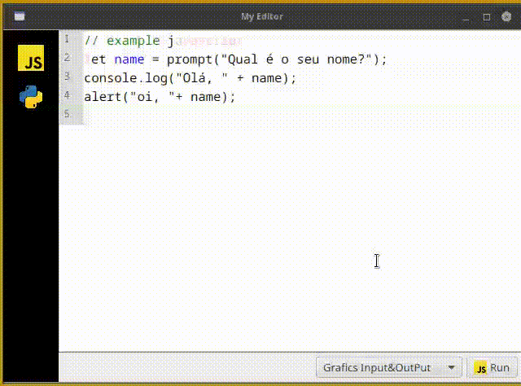

# Student editor




<br/>


Editor and Runner portable **JavaScript** and **Python**. Make in **GraalVM Polyglot** and **JavaFX**.

## How Build

 Linux debian/ubuntu:

```bash
sudo apt update
sudo apt install openjdk-21-jdk maven
git clone https://github.com/gilberto-009199/CodeEditor.git
cd CodeEditor
mvn clean package -Plinux
# or 
mvn clean package -Plinux-app-image
```


 Windows:

+ install [WixTools](https://github.com/wixtoolset/wix/releases/)
+ install [Java 21](https://www.oracle.com/java/technologies/javase/jdk21-archive-downloads.html)
+ install [Maven](https://maven.apache.org/download.cgi)
+ run:

```powershell
mvn clean package -Pwindows
# or 
mvn clean package -Pwindows-package


```


